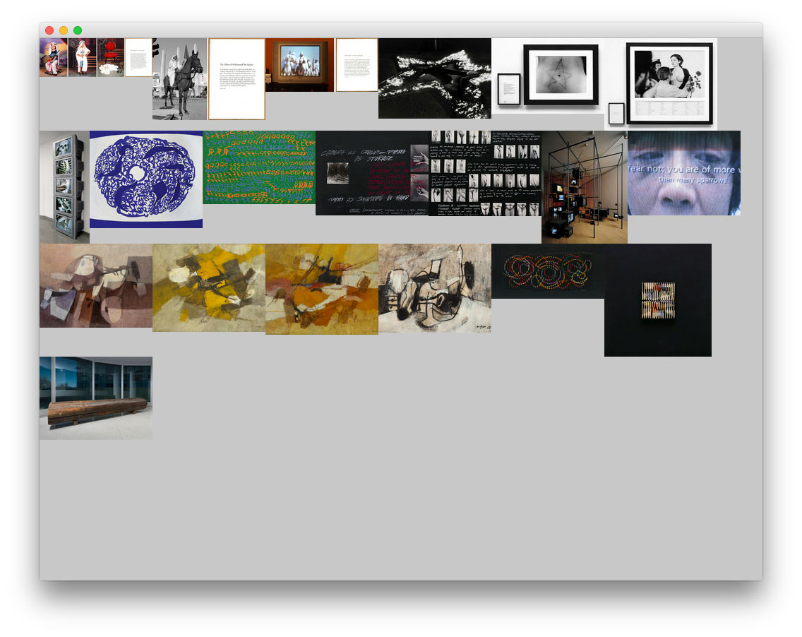

# OF_GUGGENHEIM

##Description
This example project makes HTTP requests to the Guggenheim's REST API for collection data. The API returns JSON responses containing object information that can also be found in the Guggenheim's [Collection Online](http://www.guggenheim.org/new-york/collections/collection-online) The Collection API requires a private API key.

##Requirements

- [Openframeworks v0.9.0](http://openframeworks.cc/download/)

###Core addons

- ofxNetwork
- ofxThreadedImageloader

###Contributed addons

- [ofxJSON](https://github.com/jefftimesten/ofxJSON)
- [ofxSimpleHttp](https://github.com/armadillu/ofxSimpleHttp)

##Instructions
To use this example, you will need to include your Guggenheim-provided API key into your copy of the project.

Start by copying the `GUGGAPIKEY.SAMPLE.h` file to `GUGGAPIKEY.h` 

```
$> cp GUGGAPIKEY.SAMPLE.h GUGGAPIKEY.h

```

Then edit the resulting file and replace `YOURAPIGOESHERE` with your API key that is provided by the Guggenheim.

```
$> open GUGGAPIKEY.h
```
Once you have completed this step, running the project should show artwork images after a brief download.

## Screenshot



##Troubleshooting

###GUGGAPIKEY.h not found
Follow the [instructions above](README.md#instructions) after you have received an API key from the Guggenheim.

### Blank Screen
If you see a blank screen when running the project, look at the console output in XCode (or the IDE of your choice). You will likely see the following:

```
[notice ] xxxxxxxxxxxxxxxxxxxxxxxxxxxxxxxx
#########################################################
download of http://api.guggenheim.org//collections/objects returned : KO
server reported size is 47
server status is 401
file content type is application/json
file name is objects
```
Note the first line that starts with [notice ]. Double check that this is your Guggenheim-provided API key. 

If it is correct, there may be a problem with either your API key or the API server. Please contact your contact at the Guggenheim who provided the ID.

If the API response works correctly you should see the following (where `xxxxxxxxxxxxxxxxxxxxxxxxxxxxxxxx` is your API key):

```
[notice ] xxxxxxxxxxxxxxxxxxxxxxxxxxxxxxxx
#########################################################
download of http://api.guggenheim.org//collections/objects returned : OK
server reported size is 103504
server status is 200
file content type is application/json
file name is objects
[notice ] http://annex.guggenheim.org/collections/media/160/2012.139.3_cu_web_1.jpg
[notice ] http://annex.guggenheim.org/collections/media/160/2012.139.1_cu_web_1.jpg
[notice ] http://annex.guggenheim.org/collections/media/160/2012.139.2_cu_web_1.jpg
[notice ] http://annex.guggenheim.org/collections/media/160/98.5214_ph_web.jpg
[notice ] http://annex.guggenheim.org/collections/media/160/98.5210_ph_web.jpg
[notice ] http://annex.guggenheim.org/collections/media/160/98.5211_ph_web.jpg
[notice ] http://annex.guggenheim.org/collections/media/160/98.4626_ph_web.jpg
[notice ] http://annex.guggenheim.org/collections/media/160/2002.20_ph_web.jpg
[notice ] http://annex.guggenheim.org/collections/media/160/2001.13_cu_web.jpg
[notice ] http://annex.guggenheim.org/collections/media/160/97.4568_ph_web.jpg
[notice ] http://annex.guggenheim.org/collections/media/160/97.4569_ph_web.jpg
[notice ] http://annex.guggenheim.org/collections/media/160/97.4567_ph_web.jpg
[notice ] http://annex.guggenheim.org/collections/media/160/2012.142_cu_web_1.jpg
[notice ] http://annex.guggenheim.org/collections/media/160/58.1530_ph_web.jpg
[notice ] http://annex.guggenheim.org/collections/media/160/57.1482_ph_web.jpg
[notice ] http://annex.guggenheim.org/collections/media/160/2012.20_ph_web.jpg
[notice ] http://annex.guggenheim.org/collections/media/160/98.4623_cu_web.jpg
[notice ] http://annex.guggenheim.org/collections/media/160/2009.2_ph_web.jpg
[notice ] http://annex.guggenheim.org/collections/media/160/2000.1_ph_web.jpg
[notice ] http://annex.guggenheim.org/collections/media/160/2012.138_ph_web.jpg

```

