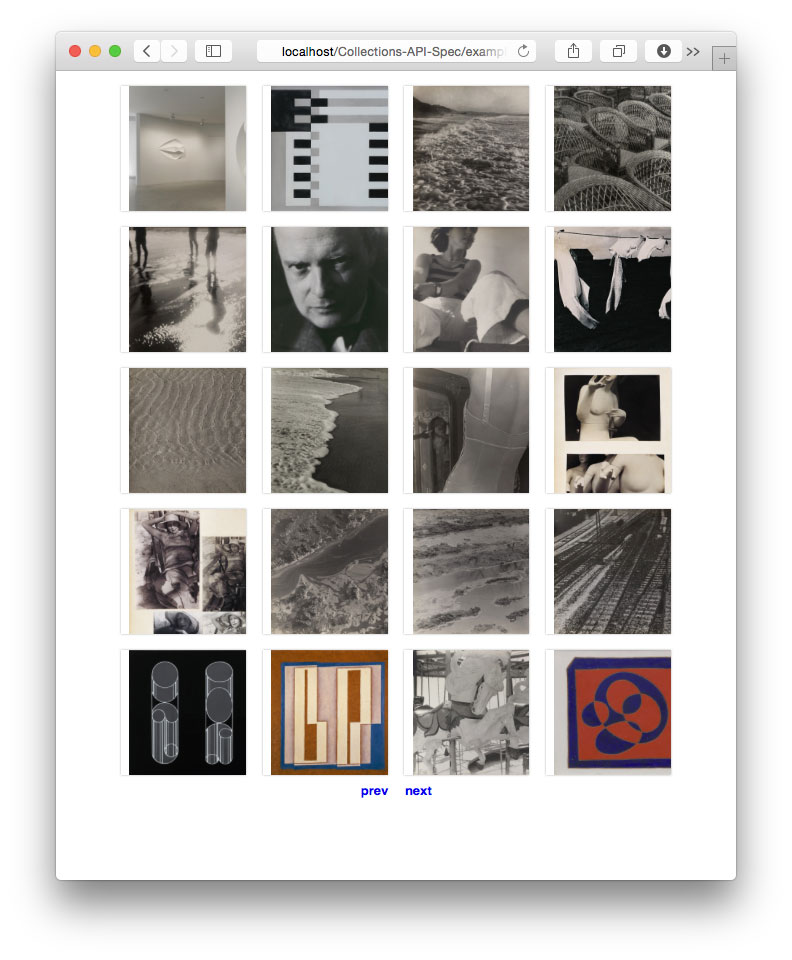

#PHP Collections API Example

##Step 1:
copy the API Sample file.

```
~/Collections-API-Spec/examples/php_guggenheim/$ cp apikey.SAMPLE.php apikey.php
```

##Step 2:
replace ```YOURAPIGOESHERE``` with the API Key assigned to you by SRGF Interactive Department.

##Step 3:
load ```index.php``` in your browser. Make sure you are running a web server that will run PHP 5.x. You should see the following:




