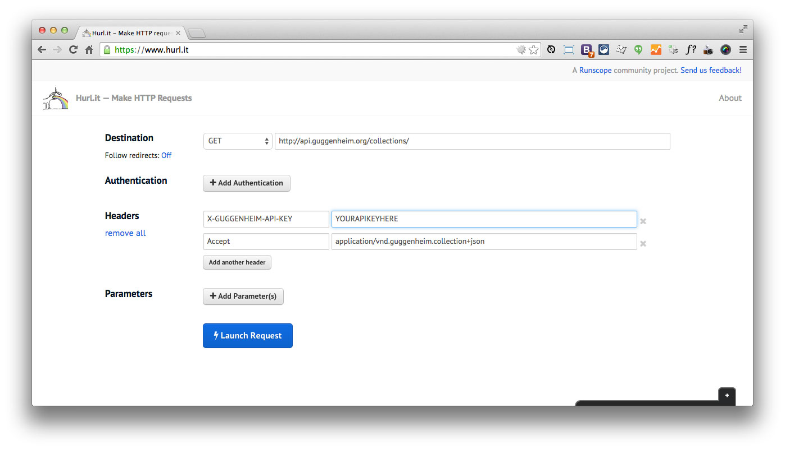
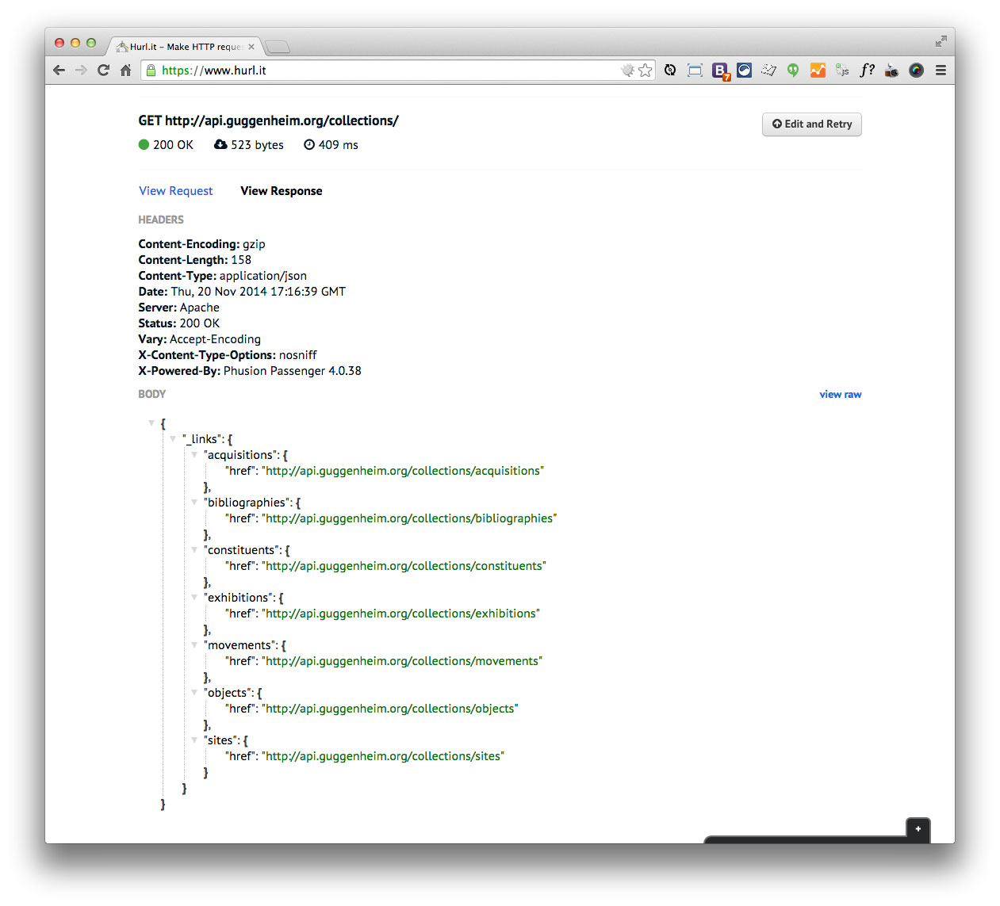

#Setup and Testing the Collections API using the Hurl.it web interface
New to the Collections API interface? This provides a simple way to test the Collections API application without any CLI knowledge.

##Step 1:

visit <a href="http://hurl.it">hurl.it</a>

##Step 2:

- Fill out the *yourapihere.com* field with ```http://api.guggenheim.org/collections/```
- Add ```X-GUGGENHEIM-API-KEY``` and ```Accept``` into the *name* field of two new *Headers*

The Accept parameter should be ```application/vnd.guggenheim.collection+json``` and the X-GUGGENHEIM-API-KEY should be the 32-character string provided by Guggenheim IT.

After entering your information, your screen should look like this:



##Step 3:

Click "Launch Request"

You should receive a screen that looks like the following:



If not, refer to the <a href="../troubleshooting.md">Troubleshooting document</a>.

Refer to <a href="https://github.com/Guggenheim/Collections-API-Spec/blob/master/README.md">README.md</a> for more endpoints

    

